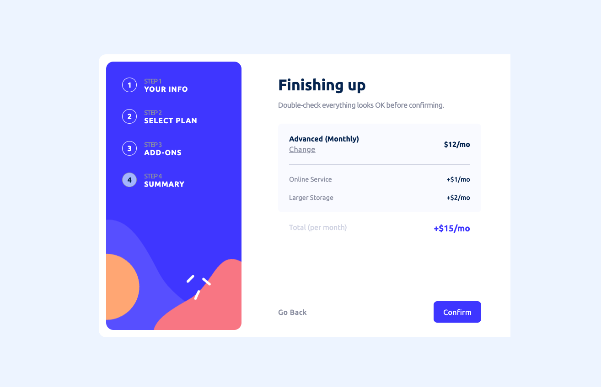

# Frontend Mentor - Multi-step form solution using React

My solution to the [Multi-step form challenge on Frontend Mentor](https://www.frontendmentor.io/challenges/multistep-form-YVAnSdqQBJ)  
This was a fun and very enriching challenge! It definitely opened my eyes to the possibilities of React and I look forward to working with it more.

## Table of contents

- [Overview](#overview)
  - [Screenshot](#screenshot)
  - [The challenge](#the-challenge)
  - [Links](#links)
- [My process](#my-process)
  - [Built with](#built-with)
  - [What I learned](#what-i-learned)
  - [Continued development](#continued-development)
- [Author](#author)

## Overview

### Screenshot



### The challenge

Users should be able to:

- Complete each step of the sequence
- Go back to a previous step to update their selections
- See a summary of their selections on the final step and confirm their order
- View the optimal layout for the interface depending on their device's screen size
- See hover and focus states for all interactive elements on the page
- Receive form validation messages if:
  - A field has been missed
  - The email address is not formatted correctly
  - A step is submitted, but no selection has been made

### Links

- Solution URL: [Add solution URL here](https://your-solution-url.com)
- Live Site URL: [Add live site URL here](https://your-live-site-url.com)

## My process

### Built with

- Semantic HTML5 markup
- CSS custom properties
- Flexbox
- Desktop first workflow
- [React](https://reactjs.org/) - JS library

### What I learned

- More on ARIA
- Custom Checkboxed
- Practice React

#### ARIA attributes

For the divs to be clickable (particularly the add-ons),  
I gave them the attribute of `role='button'` as well as `tabIndex={0}`  
This ensure that the user can tab to the div and select it using Enter or space.

This execise definitely helped me practice my use of ARIA attributes and expand my knowledge on how to see if my code is accessible.

#### Checkboxes

I learnt how to do custom checkboxes!
To achieve that I added `appearance: none` to the **checked** checkbox, and a pseudo element with a background image

```css
/* Checkbox Styling */
#addOnsContainer .addOn input {
  width: 1.2rem;
  height: 1.2rem;
  padding: 3px;
  position: relative;
}

.addOn input::after {
  content: '';
}

.addOn input:checked {
  appearance: none;
}

.addOn input:checked::after {
  content: '';
  background-image: url(../../assets/images/icon-checkmark.svg);
  background-position: center;
  background-repeat: no-repeat;
  width: 1.2rem;
  height: 1.2rem;
  position: absolute;
  z-index: 2;
  top: 0;
  left: 0;
  background-color: var(--purplishBlue);
  border-radius: 3px;
}
```

#### Practice React

I've used React previously, but had limited understanding surrounding props, the unidirectional flow and useEffect. After having my wonderful teacher explain these concepts, everything started falling more into place. I really expected to struggle more with this project but it went surprisingly smoothly and I really learnt a lot!

### Continued development

#### ARIA

I want to expand my knowledge on **ARIA** attributes more, to ensure my work is **accessible**, so that everyone has the opportunity to browse the web.

#### React

I'm loving the flow of React, and want to keep exploring how to make amazing apps with it!

## Author

- [GitHub](https://www.your-site.com)
- [Front end mentor profile](https://www.frontendmentor.io/profile/athinakantis)
- [LinkedIn](https://www.linkedin.com/in/athina-kantis/)
